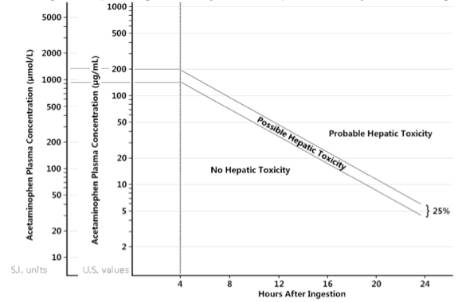

# Acetaminophen Toxicity

**Rumack Matthew Nomogram**

Note: Use for single time-point ingestion only. Does not predict toxicity in chronic ingestion.

## Background

**Acetaminophen**

- Metabolized through cytochrome P450 system to form toxic NAPQI metabolite, which requires glutathione to detoxify.
- Toxic ingestion dose = 150 mg/kg 

**Clinical Stages of Acetaminophen Overdose**

- **Stage 1** (&lt; 24 hr): Abd pain, N/V, anorexia, lethargy, diaphoresis; normal labs
- **Stage 2** (24-72 hr): RUQ abdominal pain, jaundice, rising AST/ALT/INR values 
- **Stage 3** (72-96 hr): Peak hepatotoxicity, renal insufficiency, and death vs. mild symptoms if treated
- **Stage 4** (4 days-2 wk): 70% survive acute liver failure; resolution of symptoms

## Workup and Treatment

**Lab:** Draw serum acetaminophen level at 4 hours post-ingestion. 

### Treatment

Activated charcoal
- Of benefit &lt; 1 hour of ingestion and possible benefit beyond 1 hour

N-acetylcysteine (PO or IV) 
Start within 8-10 hours if:
- Above “possible hepatic toxicity” line
- Estimated single ingestion of acetaminophen > 150 mg/kg
- Time of ingestion unknown and serum level > 10 mcg/mL
- Lab evidence of hepatotoxicity and history of excessive ingestion 
- Repeated ingestion and a serum level > 10 mcg/mL

PO: 
- First dose **140 mg/kg** 
- Then **70 mg/kg** every 4 hours 
- Typically treat for 20 hours for uncomplicated overdose

IV: 
- First dose **150 mg/kg** over 1 hour to minimize anaphylactoid reaction
- Then **50 mg/kg** over first 4 hours
- Then **100 mg/kg** over next 16 hours
- Total Dose = 300 mg/kg over 20 hours

## References

- Larson AM. Acetaminophen hepatotoxicity. Clin Liver Dis. 2007;11(3):525-48 [[PubMed](https://www.ncbi.nlm.nih.gov/pubmed/?term=17723918)]
