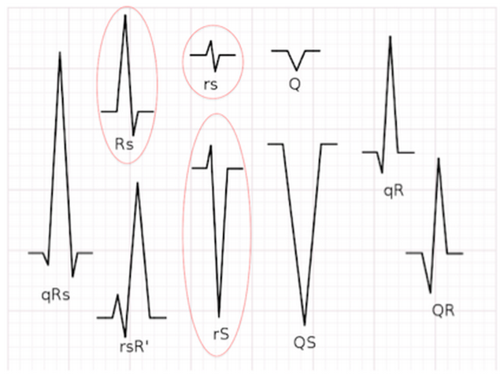
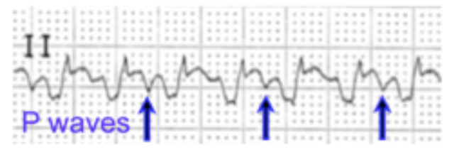
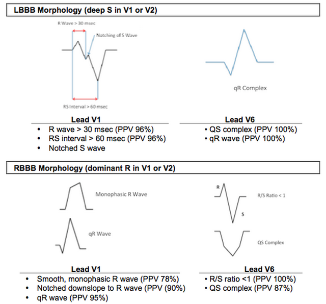

# Brugada Criteria for SVT with Aberrancy vs VT

Use this sequential 4-question approach to determine if the ECG reveals SVT with aberrancy vs ventricular tachycardia

**If you answer YES to any of these questions, it is ventricular tachycardia.**

1. Is there an ABSENCE of RS complex in all precordial leads (V1-V6?)
2. Is the R to S interval >100 msec (2.5 boxes) in one precordial lead?
3. Is there atrioventricular (AV) dissociation?
4. Is there morphology criteria for VT?

## 1. Is there an ABSENCE of RS complex in all precordial leads (V1-V6?)

- **YES:** VT diagnosis (Sensitivity 21%, Specificity 100%)
- **NO:** Move to Question 2

## 2. Is the R to S interval > 100 msec (2.5 boxes) in one precordial lead?

- **YES:** VT diagnosis (Sensitivity 66%, Specificity 98%)
- **NO:** Move to Question 3

## 3. Is there Atrioventricular (AV) dissociation?

- **YES:** VT diagnosis (Sensitivity 82%, Specificity 98%)
- **NO: **Move to Question 4

## 4. Is there morphology criteria for VT?

Determine if you have a LBBB morphology (dominant S wave in V1) or a RBBB morphology (dominant R wave in V1) then use the appropriate section below to help differentiate. Is there morphology criteria for VT?

- **YES:** VT diagnosis (Sensitivity 98.7%, Specificity 96.5%)
- **NO:** SVT with aberrance (Sensitivity 96.5%, Specificity 98.7%)

## Dr. Stephen Smith's Expert Review

Validations of the Brugada method have not had very good results.

Here is a [paper by Isenhour et al](https://www.ncbi.nlm.nih.gov/pubmed/10917326) that had, for Emergency Physician (EP) #1, a sensitivity of 83% (95% CI = 78% to 91%) and a specificity of 43% (95% CI = 25% to 59%), while EP #2 attained 79% (95% CI = 73% to 87%) and 70% (95% CI = 51% to 84%). 

Verekei has subsequently published 2 criteria which are much easier to apply and performed better than the Brugada criteria: 

1. [Heart Journal 2007](https://academic.oup.com/eurheartj/article/28/5/589/2887583/Application-of-a-new-algorithm-in-the-differential): Still a bit complex
2. [Heart Rhythm 2008](https://www.ncbi.nlm.nih.gov/pubmed/18180024): Uses aVR only

I have a [post on differentiating VT and SVT with aberrancy using the Sasaki rule](http://hqmeded-ecg.blogspot.com/2011/10/wide-complex-tachycardia-ventricular.html), which has not been validated either, but is even simpler than either Vereckei rule. I use it as a final step if I don’t have the diagnosis from 6 earlier steps. Of course, the diagnosis is not nearly as important as the management, which is easily accomplished by electrical cardioversion.

## References

- Brugada P et al. Circulation. 1991 May;83(5): 1649-59. [[PubMed](http://www.ncbi.nlm.nih.gov/pubmed/2022022)]
