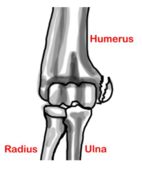

# Elbow Injuries: Epicondyle Fracture (Medial)

## Xray Views

Elbow XR: AP, lateral, external oblique

## Acute Management

- Long-arm posterior splint with elbow at 90° flexion
- Consider a long arm cast instead

## Operative Indications

- \>5 mm displacement
- Ulnar nerve dysfunction
- Entrapment of avulsed fracture fragment in joint
- Displacement in high level athletes

## Follow-up Timing

- Non-operative: Follow up in 5-7 days
- Operative: Follow up in 2-3 days

## Notes

Complications: Ulnar nerve entrapment & injury

- Usually in children 9-14 years old
- May be mistaken for medial epicondyle ossification center
- Associated with elbow dislocations
- Most can be managed non-operatively

## References

- Wheeless. Available at: http://www.wheelessonline.com/ortho/medial_epicondyle_frx_of_the_humerus. Accessed August 1, 2017.
- Orthobullets. Available at: http://www.orthobullets.com/pediatrics/4008/medial-epicondylar-fractures--pediatric. Accessed August 1, 2017.
- Radiopaedia. Available at: http://radiopaedia.org/articles/medial-epicondyle-fracture-1. Accessed August 1, 2017.
- General Guidelines For Management for Orthopedic Injuries card by the Nationwide Children’s Hospital, Department of Orthopedics
