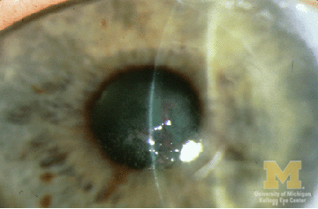

---

title: Painful Eye
authors:
    - Puja Gopal, MD
created: 2017/07/14
updates: 
categories:
    - Ophthalmology
 
---
# The Painful Eye

There is significant overlap among conditions that cause a red, painful or red and painful eye. Here are additional cards that may help in your evaluation:

- [Eye Differential Diagnoses](/cards/eye-ddx)
- [Red Eye](/cards/red-eye)

## Orbital Cellulitis

- Infectious inflammation that occurs posterior to the orbital septum, within the bony orbit
- Commonly a secondary infection extending from infections of the paranasal sinuses or upper respiratory tract
- **Symptoms**: Erythema and edema of the eyelids, vision loss, fever, headache, and diplopia
- **Physical exam**: Proptosis, chemosis, discharge, pain with eye movement, afferent pupillary defect
- **Diagnosis**: CT imaging is indicated in patients with periorbital inflammation, proptosis, ophthalmoplegia, and worsening visual acuity. MRI can be used when CT is inconclusive.
- **Treatment**: 
	- Emergent ophthalmology consultation
	- Broad-spectrum IV antibiotics
	- Surgery may be required to drain orbital abscesses or remove inciting foreign bodies

## Optic Neuritis

- A clinical diagnosis
- Inflammatory demyelination of the optic nerve
- **Symptoms**: Unilateral visual loss, change in color perception or visual field defects over hours to days; pain worse with eye movements
- **Physical exam**: Visual field defect and afferent pupillary defect, 2/3 of patients will have normal appearing optic disk 
- **Diagnostic**: Consider MRI brain/orbits for prognosis due to association with multiple sclerosis or when the diagnosis is unclear
- **Treatment**: IV methylprednisolone (250 mg every 6 hours for 3 days followed by an oral prednisone taper)

## Keratitis

- Inflammation may be superficial and involve only the corneal epithelium or deep with ulceration through the epithelium or the epithelium may remain intact and the stroma becomes inflamed (aka stromal keratitis)
- **Symptoms**: photophobia, foreign body sensation, tearing, severe pain, decreased visual acuity
- **Physical exam**: conjunctival injection, corneal infiltrate/round opacity (typically seen as a white spot) that will stain with flourescin, may see cell and flare in anterior chamber
	- In stromal keratitis, the corneal opacity will not stain with fluorescein dye.
- Complications: Corneal ulcer and perforation, scarring with partial or complete visual loss, glaucoma, uveitis

### Noninfectious Causes

- Superficial Punctate Keratitis (SPK): Multiple causes including blepharoconjunctivitis, UV light exposure (e.g. welders), dry eye syndrome, topical drug toxicity (e.g. tobramycin, eye drop preservatives)
	- **Physical exam**: Characterized by pinpoint areas of flourescin uptake
	- **Treatment**: Address the underlying cause
- Ulcerative Keratitis: Can be seen in association with a wide range of collagen vascular diseases (e.g. rheumatoid arthritis, sarcoidosis), DM (neurotrophic keratitis), vitamin A deficiency or allergic disease (atopic keratoconjunctivitis), among others 
  - **Treatment**: Determine and treat underlying cause

### Infectious Causes
- BACTERIAL: Commonly occurs due to _Streptococcus pneumoniae_ and in contact lens wearers _Pseudomonas_, _Staphylococcus aureus_ and _Serratia_
	- **Treatment**: Cephalosporin (e.g. cefazolin) + aminoglycoside or floroquinolone
- VIRAL
	- HSV: dentritic corneal defects on exam
  - **Treatment**: Topical trifluridine, oral acyclovir as alternative or adjunct 
	- VZV: forehead and upper eyelid vesicular lesions; dendritic lesions don't have well stained terminal bulbs and ulceration is uncommon compared to HSV
  - **Treatment**: Oral acyclovir or oral valacyclovir
	- Adenovirus: often bilateral diffuse punctate lesions on exam, palpable preauricular lymph node; 
  - **Treatment**: Resolves without treatment in 7-10 days
- FUNGAL: Often due to _Fusarium_ and _Aspergillus_ due to traumatic injury from vegetable matter; are often initially treated as bacterial until corneal culture results are available
  - **Treatment**: Admit to hospital
  - Mild cases - Topical antifungals
  - Severe cases - Add systemic antifungals; topical steroids are contraindicated
- AMOEBIC: Commonly _Acanthamoeba_; suspect in contact lens wearers with dentritiform lesions (thus often be confused with HSV); send corneal epithelium cultures if suspect; consult ophthalmologist
  - **Treatment** typically involves topical amoebicidal agents

## Corneal Abrasion
- **Symptoms**: Pain, photophobia, excessive tearing
- **Physical exam**: Visual acuity is normal unless the abrasion involves the visual axis or there is significant corneal edema; ciliary spasm may cause miosis; conjunctival injection
- **Diagnosis**: green flourescence at damaged area/s of cornea under Wood's lamp or cobalt blue light on slit lamp
- **Treatment**: 
  - Topical antibiotic such as erythromycin, or in contact lens wearers gentamicin or ciprofloxacin for Pseudomonal coverage
  - Pain control options: Topical NSAIDs, cycloplegics, oral analgesics (e.g. acetaminophen)
  - Do not patch
  - Discontinue contact lens use until defect heals and symptoms resolve
- **Followup**: Small abrasions heal quickly and generally require only a single 24 hour followup exam; if contact lens related, should be reexamined daily to ensure healing
- _Indications for referral to opthalmologist_: Large abrasions, defects over visual axis, abrasions that become larger or more symptomatic the next day, or development of ulcer

## References

- Dargin J, Lowenstein R. The painful eye. Emerg Med Clin North Am. 2008 Feb;26(1):199-216. [[PubMed](https://www.ncbi.nlm.nih.gov/pubmed/18249263)]
- Tsirouki T, Dastiridou AI, Ibánez flores N, et al. Orbital Cellulitis. Surv Ophthalmol. 2017; [[PubMed](https://www.ncbi.nlm.nih.gov/pubmed/29248536)]
