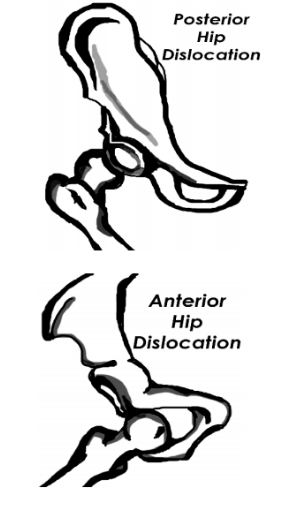

---

title: Hip Injuries - Hip Dislocation
authors:
    - Layla Abubshait, MD
    - Michael Gottlieb, MD, RDMS
    - Mary Haas, MD
created: 2016/11/14
updates:
categories:
    - Orthopedics
---

# Hip Injuries: Hip Dislocation

## Xray Views

- AP pelvis
- CT to look for acetabular fracture, loose bodies, or femoral head fracture

## Acute Management

**Reduction immediately within 6 hours** (because of avascular necrosis risk)

## Follow-up Timing

Admit and consult orthopedic surgeon.

## Notes

**Posterior dislocation (90%):** Typically presents with hip flexed and adducted; 5-15% of posterior hip dislocations are associated with a femoral head fracture

**Anterior dislocation:** Typically presents with hip abducted and externally rotated

## References

- Gill SK, Smith J, Fox R, Chesser TJ. Investigation of occult hip fractures: the use of CT and MRI. Scientific World Journal. 2013;2013:830319. [[PubMed](https://www.ncbi.nlm.nih.gov/pubmed/?term=23476147)]
- Rodriguez-Merchan EC, Moraleda L, Gomez-Cardero P. Injuries associated with femoral shaft fractures with special emphasis on occult injuries. Arch Bone Jt Surg. 2013 Dec;1(2):59-63. [[PubMed](https://www.ncbi.nlm.nih.gov/pubmed/?term=25207289)]
