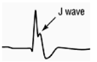

# Hypothermia, Accidental

## Stages of Hypothermia

### MILD HYPOTHERMIA 
32.2-35&deg;C (90-95&deg;F) 

| Early Stage      | Decompensated Stage                               |
| :--------------- | :------------------------------------------------ |
| Hypertenstion    | Apathy/Impaired Judgment                          |
| Tachycardia      | Ataxia                                            |
| Shivering        | Cold diuresis-kidneys unable to concentrate urine |
| Vasoconstriction | Hypovolemia                                       |

### MODERATE HYPOTHERMIA 
28-32.2&deg;C (82.4-90&deg;F)

| Clinical Findings         |
| :------------------------ |
| Atrial dysrhythmias       |
| J wave on ECG             |
| Hypotension, bradycardia  | 
| Lethargy                  |
| Mydriasis                 |
| Diminished gag reflex     |
| Loss of shivering         |
| Hyporeflexia              |

### SEVERE HYPOTHERMIA 
&lt;28&deg;C (&lt;82.4&deg;F)

| Clinical Findings         |
| :------------------------ |
| Apnea                     |
| Coma                      |
| No activity on EEG        |
| Fixed pupils              |
| Oliguria                  |
| Pulmonary edema           |
| Ventricular dysrhythmias  |
| Asystole                  |

**Tip**

- Many thermometers do not measure below 34.4°C (94°F). Need special low-tempsensing rectal or bladder thermometers.
- Avoid jostling the hypothermic patient too much because of myocardial irritability and consequent arrhythmias.

## Direct complications from hypothermia and rewarming

- Rhabdomyolysis
- Acute tubular necrosis and renal failure
- Electrolyte shifts, especially K+ because of acid-base changes during rewarming
- Hypoglycemia from depleted glycogen stores
- Functional coagulapathy: May have normal coag studies because have to be rewarmed to run the assay

## Rewarming approaches

1. **Passive Rewarming:** Remove cold, damp clothes. Wrap with blankets.
2. **Active External Rewarming:** Apply heat to skin

   - Heating blanket or radiant heat
   - Hot water bottles or heating pads to truncal surfaces. Caution-- do not burn skin.
   - Risk of “Core Temperature Afterdrop”, vasodilation with active external rewarming causes cold peripheral blood to return to heart. Give warm IV fluid beforehand.
   - Risk of “Rewarming Acidosis”. Lactate from periphery returns to core circulation. May cause transient shock during rewarming.

3. **Active Core Rewarming**

   - Humidified air, 40°C (104°F) – increases core temp by 1-2.5°C (1.8-4.5°F) per hr
   - Warm IV fluids at 40-45°C
   - Cardiopulmonary bypass or hemodialysis, Increases core temp by 1-2°C (1.8-3.6°F) every 3-5 minutes
   - Warm fluid lavage of stomach, colon, bladder, pleural space
   - Peritoneal dialysis. Normal saline at 40-45°C at 6-10 L/hr increases core temp by 1-3°C (1.8-5.4°F) per hour when combined with heated oxygen.
   - Mediastinal lavage via open thoracotomy

## Choosing a rewarming approach

### General approach

- Check glucose.    
- Consider thiamine 100 mg IV, esp if chronic EtOH at risk for Wernicke’s    
- Treat underlying etiology for hypothermia 
- Give antibiotics +/- steroids, as appropriate   

### If patient in cardiopulmonary arrest

- Intubate, CPR, ACLS protocol
- Warm IVF
- Heated humidified oxygen
- Extracorporeal rewarming (i.e. cardiopulmonary bypass), if not immediately available, do active core rewarming measures
- Rewarm to target temperature >30°C (86°F)

### If NOT in cardiopulmonary arrest AND temperature &lt;32°C (89.6°F)

- Active External Rewarming (i.e. Bair Hugger, warm blankets), and
- Minimally invasive Active Core Rewarming (warm IVF, warm air)

### If NOT in cardiopulmonary arrest AND temp &ge;32°C (89.6°F)

- Passive external rewarming measures    

## References

- McCullough L, Arora S. Diagnosis and treatment of hypothermia. _Am Fam Physician_. 2004 Dec 15;70(12):2325-32. [[PubMed](http://www.ncbi.nlm.nih.gov/pubmed/?term=15617296)]
