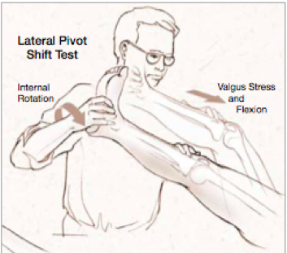
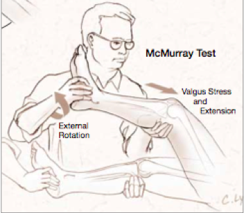

---

title: Knee Examination
authors:
    - Michelle Lin, MD
created: 2010/03/19
updates:
categories:
    - Orthopedics
    - EBM
---

# Knee Examination

## [Solomon et al, JAMA 2001](http://www.ncbi.nlm.nih.gov/pubmed/?term=11585485)

- Meta-analysis study: The accuracy of the clinical knee exam in detecting meniscal or ligamentous injury

## Anatomy of the Knee Joint

- Largest articulation in body
- Stabilized by ACL, PCL, MCL, LCL, menisci, capsule and muscle
- ACL and PCL also aid in proprioception
- **Medial meniscus:** Because it more immobile than the lateral meniscus, it is more commonly injured.

## Anterior Cruciate Ligament (ACL) Injury

**Mechanism**: Knee twist with tibia pushed anteriorlyusually with concurrent valgus stress

**Symptoms**

- May recall “pop” sound at injury
- May c/o knee buckling or “giving out”
- May notice more pronounced pain when pivoting

**Exam**

- Lachman test 
- Anterior drawer sign
- **Lateral pivot shift test:** Valgus stress on knee plus internal/external rotation of knee during knee flexion

Pivot Shift [YouTube video](http://www.youtube.com/watch?v=ZWEGB0ToXZo)

## Posterior Cruciate Ligament (PCL) Injury

- Knee twist with tibia pushed posteriorly
- Composite stats for posterior drawer sign: 
  - Positive LR 21
  - Negative LR 0.05 

## Meniscus Tear

- Menisci have no pain fibers and pain comesfrom traction on peripheral structures
- 16% asymptomatic patients have meniscustear on MRI (36% if age>45)
- Medial meniscus tear can result in knee locked in flexion (unlikely lateral meniscus because more mobile)
- Association with “clicking” noise when walking 
- **Exam:** McMurray test - British Journal of Sports Med [YouTube video](http://www.youtube.com/watch?v=fkt1TOn1UfI)
- **Lateral meniscus test**: Valgus stress on knee and internal/external rotation while flex/extending knee
- **Medial meniscus test**: Varus stress on knee and internal/external rotation while flex/extending knee

- **Exam:** Apley compression test - British Journal of Sports Med [YouTube video](http://www.youtube.com/watch?v=w57I1cYXlCA)
  - In a patient prone position, flex knee to 90 degrees and external/internal rotate knee while axially loading
- **Exam:** Medial-lateral grind test: Valgus and varus stress on knee while flex/extending knee – other hand is placed at joint line to detect grinding
- Composite stats on exam maneuvers: 
  - Positive LR 2.7, Negative LR 0.4 (Overall - not that great) 

## Knee Exam

Conduct exam first on normal knee for comparison 

Inspection: Look for atrophy, effusion

- **_Tip:_** Collateral ligament injuries often have no effusion in acute setting

Palpation: Look for crepitus as sign of cartilage disruption, joint line tenderness 

Function: Perform stress maneuvers

## Check for Historical Clues

- Typical effusion onset: Immediate = meniscus or cruciate ligament tear
- Pop noise at time of injury = ACL tear
- Clicking/locking sensation = Meniscus injury

## Fagan Nomogram

## References

- Solomon DH et. al.The rational clinical examination. Does this patient have a torn meniscus or ligament of the knee? Value of the physical examination. _JAMA_. 2001 Oct 3;286(13):1610-20. [[PubMed](http://www.ncbi.nlm.nih.gov/pubmed/?term=11585485)]
