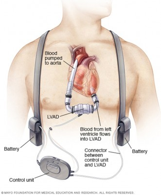
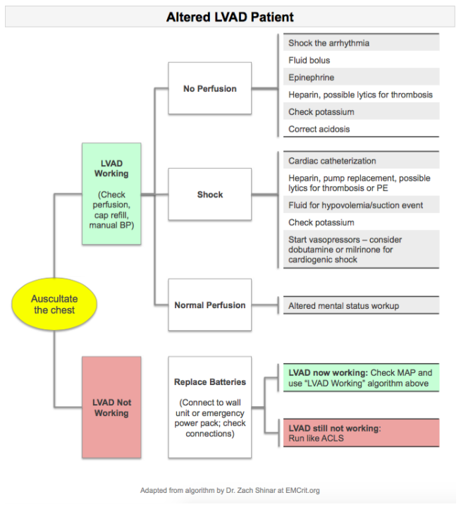

# Left Ventricular Assist Device Complications

- These patients MAY NOT HAVE A PULSE    
  - May need an ABG since pulse oximetry may be inaccurate without a pulse
- Contact your hospital’s or network’s LVAD Coordinator immediately to help with management and troubleshooting.
- Patients are usually on diuretics, and may be intravascularly depleted or have electrolyte abnormalities

## LVAD Patient in Extremis: Step-Wise Diagnostic Approach

### Step 1

- Address airway, breathing, circulation
- Obtain IV, O2, monitor
- Measure blood pressure: May need manual cuff with Doppler to obtain mean arterial pressure (MAP), or use arterial line (MAP goal 70-80 mmHg)
- Assign someone to call LVAD Coordinator

### Step 2

- **A** uscultate precordium. Is there a hum?
  - Yes - LVAD is working. 
  - No - LVAD is not working.
- **B** attery: Make sure it is plugged in.
- **C** ontroller: Check for alarms.
- **D** riveline: Check device type and evidence of infection or damage
- **E** chocardiogram

### Step 3

- Obtain VAD variables: Flow, Power, Speed, Pulsatility Index

### Step 4

- Obtain ECG
- Obtain labs:
  - CBC
  - Electrolytes
  - Coagulation studies
  - LDH
  - Type and screen given GI bleed risk
  - ± Blood cultures if infection concern
  - ± ABG

## Echocardiogram Findings - Causes & Management

### Big right ventricle, big left ventricle

**Potential Causes**

- Pump failure
- Pump thrombosis
- Valve disorders

**Management**

- Heparin
- Antiplatelet agents
- Thrombolytics

### Big right ventricle, small left ventricle

**Potential Causes**

- Right heart failure
- ST-elevation MI
- Pulmonary hypertension
- Note: If LV to outflow cannula size ratio is 1:1, then high risk for suction event

**Management**

- IV fluids
- ECG
- Consider inotropes

### Small right ventricle, small left ventricle

**Potential Causes**

- Hypovolemia
- Sepsis
- GI bleed

**Management**

- IV fluids
- Consider blood transfusion
- Antibiotics

## LVAD Complications

### Arrhythmia

- Up to 50% experience sustained VT/VF in first 4 weeks after LVAD placement
- Difficult to determine primary vs. secondary cause:
  - Primary: Compromised myocardium + scar tissue
  - Secondary: Electrolyte abnormalities, hypotension, suction events
- Management depending on the cause:
  - IV fluid challenge is reasonable
  - Reduce pump speed
  - Correct electrolytes
  - Electrical or pharmacologic: amiodarone, cardioversion

### Infection

- Up to 42% experience sepsis within 1 year (REMATCH Study). Most infections are in first 3 months, and 9% are fungal.
- Treat with broad spectrum antibiotics + antifungal

### Thrombus (pump thrombus, PE, stroke/TIA)

- High risk despite anticoagulation. 
- Pump thrombus suggested by warm device and increased power output. 
- Lab finding: Elevated LDH
- Treat with Heparin, thrombolytics, antiplatelet agents

### Bleeding

- Patients may have an acquired Von Willebrand Disease coagulopathy.
- If life-threatening, reverse anticoagulation and transfuse as needed.

### Suction Event

- An underfilled LV causing suction of myocardium into LVAD
- Can be caused by right heart failure, hypovolemia, sepsis, restrictive cardiomyopathy, arrhythmias
- Treat with IV fluids to increase LV filling.

### RV Failure

- Due to acute myocardial infarction (AMI) or previous RV failure
- Treat with IV fluids and consider inotropes. 
- Start aspirin and heparin, if AMI.

### Cannula Malposition

- Consider in setting of new VT, suction event, chest compressions, or trauma
- Requires surgical exploration

### Device Malfunction, Pump Failure

- Suggested if no hum and mean arterial pressure (MAP) &lt;40 mmHg.
- Treat cardiogenic shock: IV fluids, vasopressors, ACLS protocols, consider heparin for thrombosis

### Cardiac Arrest

- Multiple potential causes including all those listed above.
- Follow ACLS algorithms EXCEPT:
  - Chest compressions are controversial as they could dislodge the device.
  - Do NOT place defibrillation pads directly over device.
  - Assign one person to assess device placement during and after code.

## Altered LVAD Patient

## References

- Partyka C, Taylor B. Review article: ventricular assist devices in the emergency department. _Emerg Med Australas_. 2014;26(2):104-112. [[PubMed](https://www.ncbi.nlm.nih.gov/pubmed/24707998)]
- Andersen M, Videbaek R, Boesgaard S, Sander K, Hansen P, Gustafsson F. Incidence of ventricular arrhythmias in patients on long-term support with a continuous-flow assist device (HeartMate II). _J Heart Lung Transplant_. 2009;28(7):733-735. [[PubMed](https://www.ncbi.nlm.nih.gov/pubmed/19560703)]
- Greenwood J, Herr D. Mechanical circulatory support. _Emerg Med Clin North Am_. 2014;32(4):851-869. [[PubMed](https://www.ncbi.nlm.nih.gov/pubmed/25441039)]
