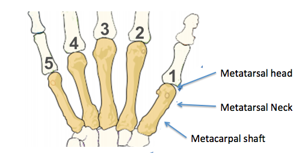

# Metatarsal and Metacarpal Fractures

## Metatarsal Head

- Typically operative, unless MCP stable and &lt; 20% articular surface involvement

## Metatarsal Neck

Most are nonoperative. 

Urgent closed reduction needed if:

- \> 10°, 20°, 30°, 40° angulation for 2nd-5th MCs, respectively, OR
- ANY rotational deformity (note scissoring with composite flexion) 

## Metacarpal Shaft

Most are nonoperative, especially 3rd and 4th MC because of inter-MC ligaments.

Urgent closed reduction needed if

- \> 10°, 10°, 20°, 20° angulation for 2nd-5th MCs, respectively, OR
- ≥ 5 mm shortening, OR
- ANY rotational deformity

*Pearl*: 

- Short oblique fractures (length of fx < 2x bone diameter) and displaced transverse fractures typically unstable and may need fixation.
- Splint with dorsal pressure over the dorsally angulated fracture site.

## Metacarpal Base

### First Metacarpal (thumb)

Intraarticular:

- Bennett (fx fragment on ulnar side of 1st MC)
- Rolando (fx fragment on ulnar & radial side of 1st MC): Typically unstable and require operative repair

Extraarticular:

- Allow up to 30° of apex-dorsal angulation and 4 mm shortening before operative repair

### Second through Fourth Metacarpals

Operative repair if ≥ 2 mm articular surface displacement or significant angulation

### Fifth Metacarpal

Extraarticular: Typically stable because of inter-MC ligaments

Intraarticular (high-energy injury): Unstable

- Fracture line between inter-MC ligaments and insertion of extensor carpi ulnaris tendon, causing base to displace proximal and dorsal
- Typically will need fixation

*Pearl*: 4th and 5th MC base fractures are frequently fx-dislocations. Check lateral xray to ensure the carpo-MC joint is reduced.

## Splinting

### Thumb

- Thumb spica
- Wrist extension 20°, thumb abduction

### Second or Third Fingers

- Radial gutter or volar
- Wrist extension in 20°, MCP flexion in 90°, keep IPs free

### Fourth or Fifth Fingers

- Ulnar gutter
- Wrist extension in 20°, MCP flexion in 90°, keep IPs free

## References

- Wheeless Online. Available at: http://www.wheelessonline.com/ortho/hand_and_metacarpal_fractures. Accessed August 1, 2017.
- Browner BD. Skeletal Trauma, Basic Science, Management, and Reconstruction. Elsevier Health Sciences; 2009.
- Hockberger RS, Walls RM. Rosen's Emergency Medicine - Concepts and Clinical Practice, 2-Volume Set,Expert Consult Premium Edition - Enhanced Online Features and Print,7, Rosen's Emergency Medicine - Concepts and Clinical Practice, 2-Volume Set. Elsevier Health Sciences; 2009.
- Emedicine. Available at: http://emedicine.medscape.com/article/1239721-overview. Accessed August 1, 2017
