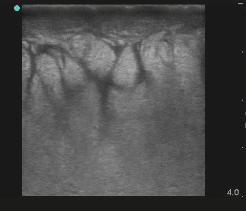
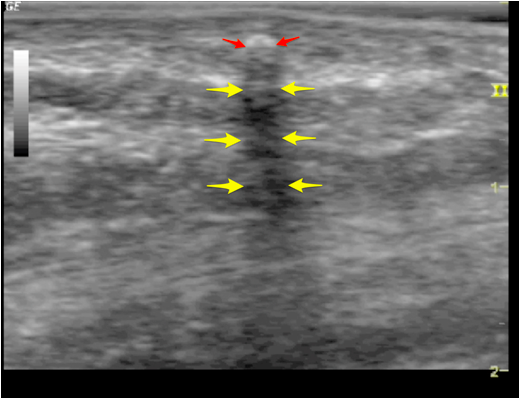

# Ultrasound: Skin and Soft Tissue

**Goals:** Use ultrasound to evaluate the skin or soft tissue to identify and differentiate various types of pathology.

**Transducer:** High frequency linear transducer. Consider low frequency curvilinear transducer for deeper structures. Use a “superficial” or similar preset.

**Windows:** Image the area of interest in both longitudinal and transverse planes.
Scan completely through the affected area to define borders.
Use an adjacent or contralateral (unaffected) area as a comparison.

## Normal Skin and Soft Tissue

**Hypodermis:** Varying thickness, less echogenic (epidermis/dermis can be difficult to distinguish)

**Muscle:** Hypoechoic with hyperechoic fibro-fatty septae and surrounding fascia

**Lymph nodes**: Hypoechoic oval/kidney bean shape cortex with fatty echogenic hilum (vascular)

**Subcutaneous fat**: Hypoechoic with thin echogenic septations

**Fascia:** Hyperechoic linear stripes

**Bone**: Hyperechoic linear structure parallel to skin surface with posterior shadowing

## Abscess

- Can vary in appearance but typically hypo- or anechoic areas with a regular or irregular border.
- Contents may be seen to "swirl” or “squish” when purulent material moves with compression by the transducer.
- If anechoic and regular circular border, may be difficult to distinguish from a cyst.

Figure 1: Subcutaneous abscess characterized by a mixed echogenicity **fluid collection with irregular borders** (yellow arrows)

## Cellulitis

Appears as "cobblestoning," caused by interstitial edema separating adipose tissue.

Figure 2: Cellulitis

## Foreign Body

- Will vary in appearance based on composition
- May exhibit the "halo sign" which appears as hypoechoic ring surrounding a hyperechoic foreign body (generally only present in foreign bodies of >24 hours)

Figure 3: A subcutaneous **wooden foreign body** (red arrows) is identified with **deep shadowing** (yellow arrows)

## Struggling with the Exam?

### Is your preset set correctly?

- Make sure you are using a “superficial” preset. A vascular or vascular access preset has a very high contrast (low dynamic range) & can make it difficult to identify subtle skin and soft tissue findings.

### Looking for abscess?

- Other structures may be mistaken for abscess including lymph nodes, solid masses, hematoma, deep venous thrombosis, or cyst. Be sure to slide all the way through the structure in 2 planes to define its borders.

### Looking for foreign body?

- Other hyperechoic structures may be mistaken for a foreign body including tendons, fascia, etc.

### Is the area is too painful to apply a probe?

- Try a water bath or heap up a generous pile of ultrasound gel to improve image acquisition and decrease the discomfort of the exam.

## Common Errors

Be sure to familiarize yourself with normal anatomy when performing exams to avoid mistaking artifacts and normal structures for pathology.

Fine movements and control of probe is necessary for accuracy and to avoid slipping off the area of interest when performing with soft tissue ultrasound. Consider resting the ulnar aspect of your hand or your 5th digit on the patient adjacent to the area of interest in order to maintain appropriate transducer position.

## References

- Tayal VS, Hasan N, Norton HJ, Tomaszewski CA. The effect of soft-tissue ultrasound on the management of cellulitis in the emergency department. Acad Emerg Med. 2006;13(4):384-8. [[PubMed](http://www.ncbi.nlm.nih.gov/pubmed/16531602)]
